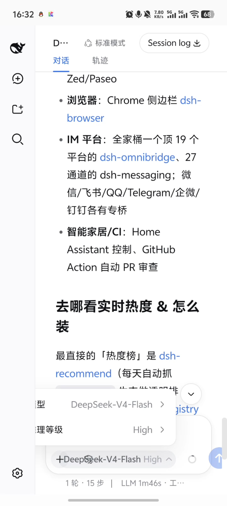
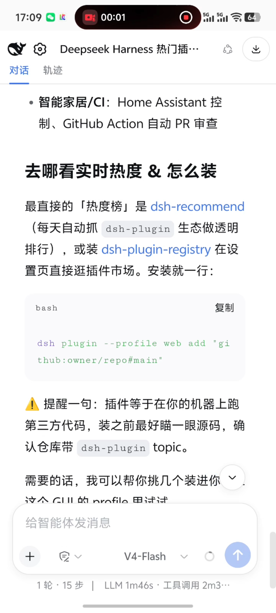
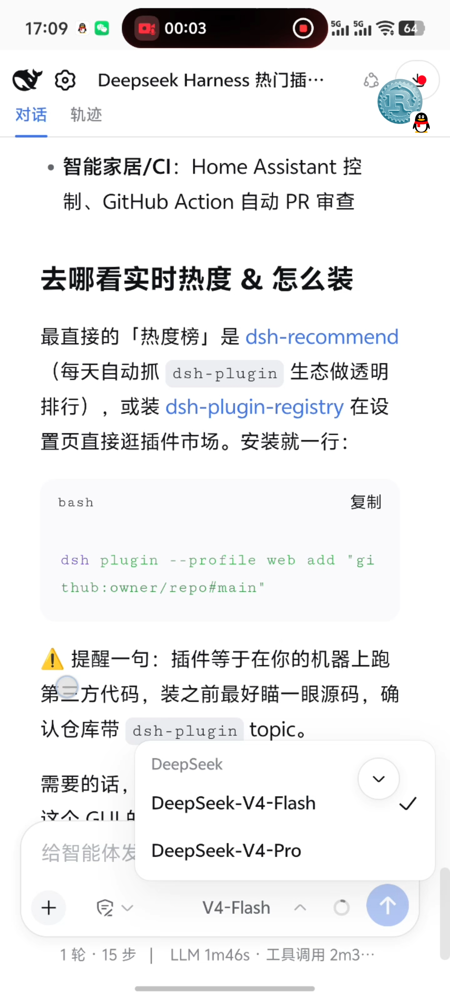
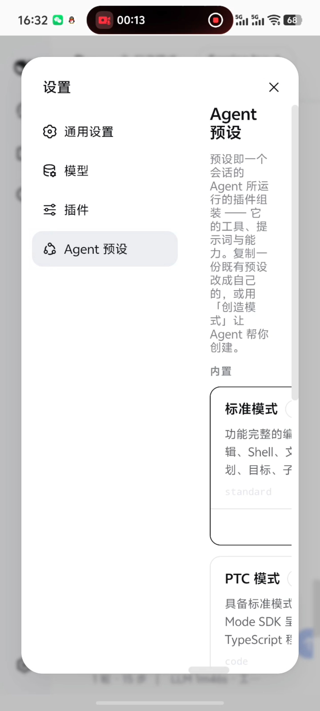
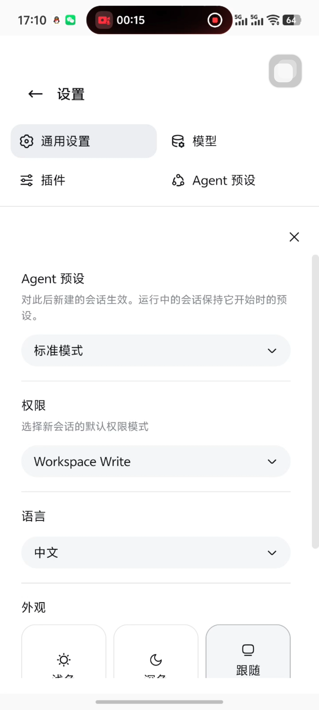

# dsh-web-ui-mobile

English | [简体中文](./README.md)

`dsh-web-ui-mobile` is a mobile adaptation plugin for the official DeepSeek Harness Web UI. It is designed primarily for phones while also accommodating tablets and foldable devices. The plugin is distributed as a standalone DSH bundle, does not modify DeepSeek Harness source files, and leaves the official layout in place at desktop widths.

## Features

### Viewports up to 760px

- The session sidebar and details panel open as overlays so the conversation retains the usable page width.
- Selecting a session closes the sidebar and opens that conversation.
- Clicking the backdrop to the right of the sidebar closes the sidebar.

### Viewports up to 600px

- The collapsed official sidebar no longer reserves space on the left.
- Sidebar and settings buttons appear to the left of the conversation title, including in the empty conversation header.
- The sidebar covers the conversation when opened, and settings provide an in-flow back button.
- Settings use a full-screen phone layout with readable navigation, content, and controls, without horizontal page scrolling.
- Model selection and context usage popups stay inside the visible viewport.
- The composer uses a compact model name while retaining the full name as accessible text.
- A collapsed empty details panel does not cover the conversation.

### Viewports wider than 760px

- The official DeepSeek Harness desktop layout remains unchanged.

## Before and after

### Conversation layout and sidebar

| Before | After |
| --- | --- |
| <br>The collapsed official sidebar still reserves a full strip on the left, reducing the conversation width on a phone. | <br>The conversation uses the full width by default. Sidebar and settings controls sit to the left of the title, and the sidebar opens as an overlay when needed. |

### Model selection

| Before | After |
| --- | --- |
| <br>The model picker extends beyond the visible phone area, clipping text and options. | <br>The popup width and position fit the phone viewport, keeping model names fully visible and readable. |

### Settings

| Before | After |
| --- | --- |
| <br>The navigation compresses the content area, leaving settings text and controls too narrow to read comfortably. | <br>Settings navigation and content use a mobile layout so each setting remains visible and operable. |

## Install

Add a local checkout to an existing profile:

```sh
dsh plugin --profile web add ./dsh-web-ui-mobile
```

After the package is published to npm, install it by package name:

```sh
dsh plugin --profile web add dsh-web-ui-mobile
```

Restart the profile after installation. No separate build step is required because the browser entry is distributed as source JavaScript.

## Remove

```sh
dsh plugin --profile web remove dsh-web-ui-mobile
```

Restart the profile after removal.

## Development

Run the package checks before installing a checkout:

```sh
npm run check
```

The browser implementation is in `src/client.js`; `src/index.js` is the DSH host entry point. `cordis.patch.yml` mounts the plugin in the selected profile.

## Compatibility

The plugin integrates with DOM slots exposed by the official Web UI. Changes to those slots may require a matching plugin update.

## License

MIT
